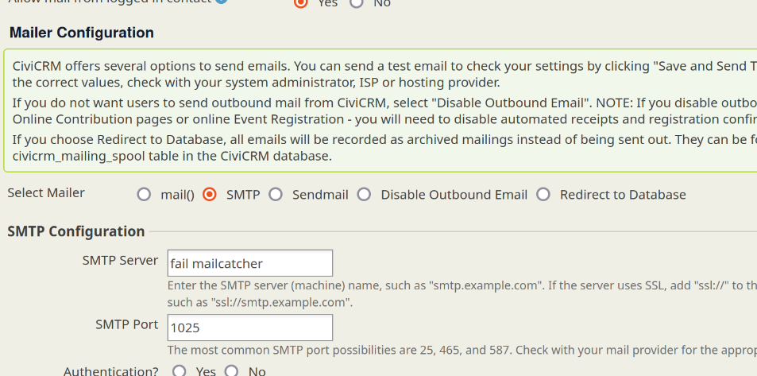

# symfony_mailer
This adds support for Symfony Mailer to be used with CiviCRM.

CiviCRM ships with PEAR mailer - which is old and poorly maintained and missing
newer features such as fall-over or load balancing across servers. Symfony mailer
seems to be the newer library with the most traction (now that Swift mailer has
been abandoned in favour of it.)

While not the primary goal of this extension, there is support for a
wide variety of third part providers within symfony_mailer
https://symfony.com/doc/current/mailer.html - these should be usable with
this extension provided you
- take steps to install the relevant composer package on your site and
- 'push'  the dsn into the mailing_backend setting
Doing the above is untested & if this extension is developed further in that
direction the config would need revisting.

This is an [extension for CiviCRM](https://docs.civicrm.org/sysadmin/en/latest/customize/extensions/), licensed under [AGPL-3.0](LICENSE.txt).

## Getting Started

The extension is not currently set up to ship with the vendor directory - so
the site admin needs to do that. No special configuration is otherwise required.

However, if you wish to take advantage of smtp failover then enter your smtp servers
into the normal smtp server box, but with a space between them.

It is possible to set the time out by setting - but not currently in the UI - the setting
is symfony_mail_timeout

## Known Issues

I have implemented failover but not round-robin for high availability - if there is demand
it would make sense.

- attachments!!!
- add support for changing the reply-to
